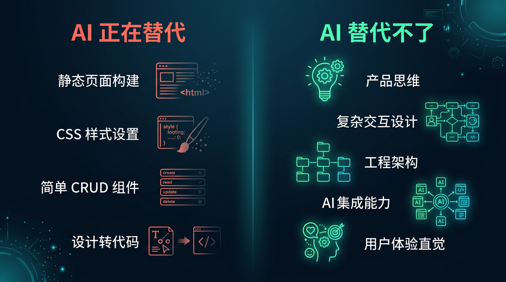
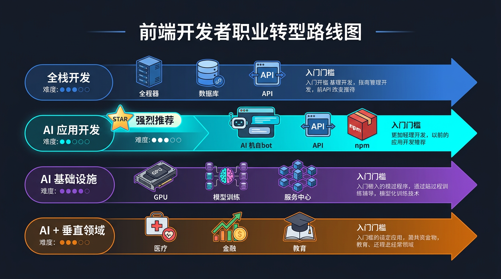

# 前端不会死，但只写页面的前端会

> 本文是【前端转 AI 全栈实战】系列第 01 篇。
> 下一篇：[AI 全栈开发的技术全景图：前端需要补什么](/series/junior/02-ai-tech-landscape)

---

## 先说结论

前端这个岗位不会消失。但如果你现在的工作内容是 **"接设计稿 → 写页面 → 联调接口 → 提测上线"** 的循环，那确实危险了。

不是前端不行了，是这种 **"人肉翻译设计稿"** 的工作模式正在被 AI 快速替代。

这篇文章不贩卖焦虑，而是聊清楚三件事：

1. 到底发生了什么
2. 你手里有什么牌
3. 往哪个方向走最合理

---

## 2025-2026，前端就业市场发生了什么

如果你最近看过招聘网站，应该有直观感受：

- 纯前端岗位的数量在**持续萎缩**，尤其是初中级
- "前端"这个 Title 越来越多地被替换成"全栈开发"、"AI 应用开发"
- 面试里开始问 "你用过 Cursor 吗"、"你了解 AI API 吗"
- 很多外包和中小团队已经在用 AI 生成 80% 的页面代码

这不是危言耸听。我自己在求职和招聘两端都看到了这个趋势：

**供给端**：大量培训班还在批量生产 "Vue 全家桶 + Element UI" 的初级前端。

**需求端**：企业发现 Cursor + v0 + Claude 可以在几分钟内生成一个像样的页面，不需要再养一个人专门写 HTML 和 CSS。

但这不代表前端死了。这代表 **前端的准入门槛提高了**。那些只会"照着设计稿像素级还原"的工作，确实在被 AI 吃掉。

---

## Cursor / Copilot / v0 正在替代的是什么

让我具体说说 AI 工具在替代前端的哪些工作：

**Cursor / Copilot**：你描述一下需求，它直接给你写出组件代码。不是片段补全，是整个文件。一个 Vue 组件、一个 React Hook、一个工具函数——从 template 到 script 到 style，一把生成。

**v0 / Bolt**：输入一句 "做一个用户列表页面，有搜索和分页"，直接出完整可预览的页面。带样式、带交互、带响应式。

**Claude / GPT-4**：贴一张设计稿截图，它能直接输出 HTML + Tailwind CSS 代码，还原度相当不错。

这意味着什么？意味着 **"把设计稿翻译成代码"** 这个工作的价值，在快速归零。

但且慢——这只是前端工作的一部分。

---

## AI 替代不了的前端能力

如果你干了一两年前端，你的能力绝不只是"写页面"。你可能没意识到，但以下这些能力是 AI 短期内替代不了的：

### 产品思维

用户点了这个按钮之后应该发生什么？加载状态怎么表现？异常情况怎么处理？空数据页面长什么样？

这些决策不是 AI 能自己做的。AI 可以写代码，但它不知道你的用户是谁、你的产品逻辑是什么、你的老板今天又改了什么需求。

### 工程化能力

monorepo 怎么组织？构建流程怎么优化？CI/CD 怎么配？代码规范怎么落地？

这些是 AI 生成不了的。AI 能帮你写一个 webpack 配置，但它设计不了整个项目的工程化方案。

### 复杂交互

拖拽排序、虚拟滚动、复杂表单联动、富文本编辑器、Canvas 绑定、WebGL 渲染——这些场景的复杂度远超 AI 当前的能力。

你让 AI 写一个简单的 Todo List 没问题，让它写一个支持协同编辑的文档编辑器？还差得远。

### AI 集成能力

这是新出现的能力维度，也是本系列要重点讲的：**把 AI 能力集成到产品中**。

调 AI API、处理流式输出、设计 Prompt、管理对话上下文、构建 RAG 系统、开发 MCP Server——这些是全新的技能点，目前市场上会做的人很少，但需求增长很快。

**前端天生离用户最近**，做 AI 应用集成是最自然的事。

---

## 四条转型路线，哪条适合你

如果你决定不再只写页面，可以往哪走？我总结了四条路线：

### 路线一：全栈开发

**方向**：前端 + Node.js / Go / Java 后端

**优点**：市场需求大，很多中小公司就需要一个全栈。

**缺点**：卷。后端的水很深，你要和科班出身的后端竞争。而且 AI 对全栈的替代也在加速——Cursor 写后端 CRUD 比写前端还快。

**适合**：想进中小公司或创业团队，不挑方向，什么都能干的人。

### 路线二：AI 全栈开发 ⭐ 推荐

**方向**：JS/TS 搞前端和工具，Python 搞 AI 后端，双语言覆盖 AI 全栈

**优点**：
- 前端技能直接复用——HTTP 请求、JSON 处理、流式渲染、UI 开发，你都会
- Python 入门成本极低——前端学 Python 比学 Java/Go 快得多，语法相似度高
- 市场需求爆发中——每个产品都在加 AI 功能，"前端 + Python + AI" 组合极度稀缺
- 不需要学算法——你在应用层，用 LangChain/Google ADK 等框架就够了
- 可以沉淀全栈作品——npm 包、FastAPI 后端、AI Agent、完整的全栈 AI 产品

**缺点**：需要多学一门语言（但 Python 真的不难），方向太新没有成熟学习路径（这也是我做这个系列的原因）。

**适合**：有 1-3 年前端经验，想彻底打开技能天花板的人。

### 路线三：AI 基础设施

**方向**：模型训练、推理优化、GPU 集群、MLOps

**优点**：技术壁垒高，薪资天花板高。

**缺点**：需要转 Python，学习曲线陡峭，和前端技能栈几乎没有交集。

**适合**：本身有算法/数学功底，愿意从头学起的人。对大部分前端来说，这条路线的 ROI 不高。

### 路线四：AI + 垂直领域

**方向**：AI + 医疗 / 教育 / 金融 / 电商等特定行业

**优点**：领域知识是护城河，不容易被替代。

**缺点**：需要积累行业知识，入行有壁垒。

**适合**：已经在某个行业深耕，想叠加 AI 能力的人。

---

### 为什么我推荐"AI 全栈"

对大部分前端来说，**路线二是性价比最高的选择**，理由很简单：

1. **前端技能不是从零开始**。调 API、处理 JSON、管理状态、渲染 UI——这些在 AI 应用开发中都是核心技能。你不是转行，是在已有基础上叠加新能力。

2. **Python 对前端来说是最友好的第二语言**。变量不用声明类型（像 JS）、有 async/await（像 JS）、FastAPI 的路由写法和 Express 很像。前端学 Python 比学 Java/Go 的门槛低得多。

3. **"前端 + Python + AI" 组合极度稀缺**。每个产品经理都在说"加个 AI 功能"，但既能写好前端 UI，又能用 Python 搞定 AI 后端的人，市场上真不多。

4. **可以渐进式转型**。先用 JS/TS 调 AI API，再学 Python 写 FastAPI 后端，然后用 LangChain/ADK 做 Agent。不需要辞职学三个月，边上班边练。

5. **全栈作品远比纯前端作品有说服力**。一个完整的 AI 全栈项目（Python 后端 + Vue 前端 + AI Agent），面试时的竞争力比 10 个静态页面强得多。

---

## 我的转型时间线

说说我自己的经历，给你一个参考坐标。我 2021 年毕业，前端干了将近 4 年。

**2021-2024：纯前端阶段**

标准的前端开发，Vue3/React + TypeScript，写页面、写组件、联调接口、做跨端适配。工作内容 90% 是"把设计稿变成代码"。

**2025 年初：转折点**

开始密集使用 Cursor 写代码，发现一个扎心的事实——我日常工作的大部分，AI 真的可以做。写一个 Vue 组件、调一个接口、做一个表单页面，Cursor 几分钟搞定，我要写半天。这让我认真思考：**如果 AI 能写页面，那我的价值是什么？**

**2025 上半年：开始转型**

- 先从调 AI API 开始，用 Node.js 调 DeepSeek，做了几个小脚本
- 发现 AI 后端生态几乎全是 Python（LangChain、FastAPI 等），纯用 JS 做不了深度的东西
- **咬牙开始学 Python**——比想象中简单得多，因为 async/await、JSON、HTTP 这些概念前端都有
- 用 FastAPI 写了第一个 AI 后端，发现前端转 Python 后端的体验出奇地好
- 做了 [ai-review-pipeline](https://github.com/hyxnj666-creator/ai-review-pipeline)——一个 AI 代码审查 CLI 工具（Node.js），发到了 npm

**2025 年底至今：AI 全栈工程师**

Title 从"前端开发"变成了"AI 全栈工程师"。工作内容完全不一样了——前端在做 AI 平台的架构设计（Chat/Workflow/Agent/RAG 等模块），后端用 Python/FastAPI 独立交付 AI 服务，前后端都自己搞。

从开始转型到拿到 AI 全栈的 offer，大概 **不到一年**。整个过程没有脱产学习，没有学算法。**JS/TS 搞定前端和工具，Python 搞定 AI 后端，两条腿走路。**

如果要我总结一句话：**前端转 AI 全栈，Python 是必须补的那条腿，但它真的不难学。**

---

## 这个系列要带你做什么

这是【前端转 AI 全栈实战】系列的第一篇，后面的内容安排是这样的：

| 阶段 | 内容 | 技术栈 | 你会得到 |
|------|------|--------|----------|
| AI API 入门 | 调 AI API、流式输出、多模型适配、Prompt 工程 | JS + Python 双版本 | 能独立对接各种 AI 服务 |
| AI 工具开发 | CLI 工具、npm 发包、Git Diff + AI | Node.js | 有自己的开源 AI 工具 |
| AI 全栈应用 | Python 后端入门、AI 聊天全栈、RAG、Agent | FastAPI + Vue/React | 能做完整的 AI 全栈产品 |
| MCP 生态 | MCP Server 开发、AI 生态集成 | Node.js / Python | 掌握最新的 AI 协议 |
| 扩展开发 | Chrome 扩展 + AI、VS Code 插件、多模态 | JS/TS | 有亮眼的个人项目 |
| 工程化 | 成本优化、测试、部署、AI 平台 | Docker + CI/CD | 能在生产环境落地 AI |

**JS/TS 和 Python 双线并进**，每篇文章都有可运行的代码，不是概念科普，是实战教程。

---

## 总结

1. **前端岗位不会消失**，但"只写页面"的工作正在被 AI 替代。
2. 你手里的牌比你想的多：**HTTP 请求、JSON 处理、流式渲染、状态管理、UI 开发**——这些在 AI 全栈开发中都是核心技能。
3. 四条转型路线中，**AI 全栈**（JS/TS + Python）对前端来说是天花板最高、市场需求最旺盛的方向。
4. 不需要学算法，但**需要学 Python**——这是 AI 全栈的第二条腿，而且比你想的简单得多。

**下一篇**，我们来画一张完整的技术地图：AI 全栈开发到底涉及哪些技术，前端已经会的有哪些，需要新学的有哪些，Python 部分要学到什么程度。

---

> **下一篇预告**：[02 | AI 全栈开发的技术全景图：前端需要补什么](/series/junior/02-ai-tech-landscape)

---

**讨论话题**：你现在的前端工作中，有多大比例已经可以被 AI 工具替代了？你开始尝试用 AI 做开发了吗？欢迎评论区聊聊。
