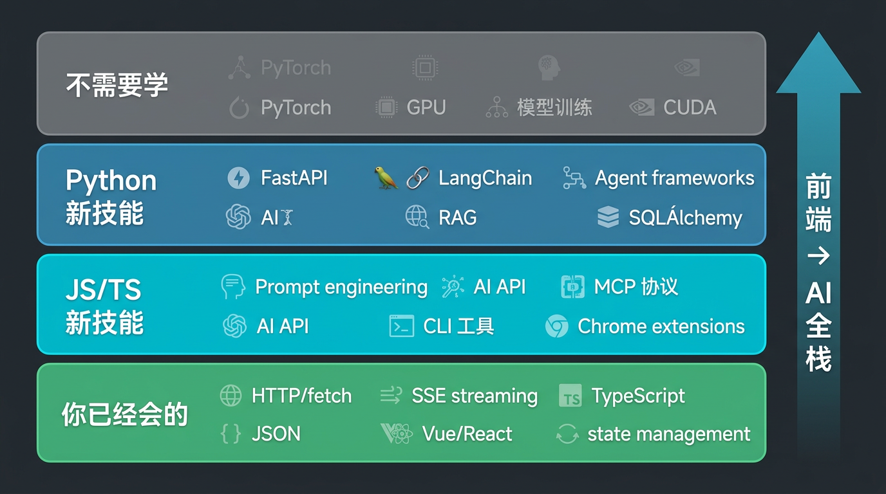

# AI 全栈开发的技术全景图：前端需要补什么

> 本文是【前端转 AI 全栈实战】系列第 02 篇。
> 上一篇：[前端不会死，但只写页面的前端会](/series/junior/01-frontend-wont-die) | 下一篇：[用 JS 和 Python 分别调通你的第一个 AI API](/series/junior/03-first-ai-api)

---

## 这篇文章要解决什么问题

上一篇我们聊了前端转型的方向，结论是 **AI 全栈（JS/TS + Python）** 是最值得走的路。

但"AI 全栈"这四个字太大了，具体到技术层面：

- AI 应用到底涉及哪些技术？
- 我作为前端，哪些已经会了？
- 需要新学的东西有多少？
- Python 要学到什么程度？
- 哪些东西看着吓人但其实不用学？

这篇文章给你画一张**完整的技术地图**，让你心里有数——不至于觉得"什么都要学"而焦虑，也不至于低估需要补的东西。

---

## LLM 是什么？前端理解到这个程度就够了

先快速建立一个基础认知。LLM（Large Language Model，大语言模型）就是 ChatGPT / DeepSeek / Claude 背后的技术。

**前端只需要理解三件事：**

**1. 它是一个"文本进、文本出"的函数**

```
输入：一段文字（Prompt）
输出：一段文字（AI 的回复）
```

从 API 调用的角度看，LLM 就是一个 HTTP 接口。你发一个 POST 请求，带上你的问题，它返回一个 JSON，里面是回答。和你调后端接口没有任何区别。

**2. 它是概率性的，不是确定性的**

同样的输入，可能得到不同的输出。这和你之前写的前端完全不一样——调一个后端 API，同样的参数永远返回同样的结果。但 AI 不是。

这意味着你需要学会处理"不确定性"：输出格式可能不一致、回答质量可能波动、偶尔会"胡说八道"（幻觉）。

**3. 它按 token 计费**

Token 大约等于 0.75 个英文单词或 0.5 个中文字。每次调 AI API 都有成本——输入的 token 收费，输出的 token 也收费。模型越强，越贵。

**就这三点。** 你不需要知道 Transformer 架构是什么、注意力机制怎么算、梯度下降怎么优化。那是训练模型的人要操心的事，不是你的事。

---

## 你在哪一层：API 调用 vs 微调 vs 训练

AI 技术栈可以分成三层，你需要确认自己在哪一层：

| 层级 | 做什么 | 需要的技能 | 适合谁 |
|------|--------|-----------|--------|
| **模型训练** | 从零训练一个 LLM | PyTorch、GPU 集群、数学 | AI 研究员 |
| **模型微调** | 在已有模型上用私有数据调优 | Python、ML 框架、标注数据 | ML 工程师 |
| **应用开发** | 调 API、写 Prompt、搭产品 | JS/TS、Python、HTTP、UI | **你（前端转 AI 全栈）** |

**我们在最上面一层——应用层。**

这一层不需要理解模型内部原理，就像你用 MySQL 不需要知道 B+ 树怎么实现一样。你要做的是：

- 会调 AI API（和调后端接口一样）
- 会写好的 Prompt（让 AI 按你要的格式回答）
- 会处理 AI 的输出（流式渲染、格式解析、错误处理）
- 会用 Python 框架搭 AI 后端（FastAPI + LangChain）
- 会把 AI 能力集成到产品中（前端 UI + 后端服务）

---

## 技术全景图：四层能力模型

下面这张图是 AI 全栈开发的完整技术地图，分成四层：



### 第一层：你已经会的（直接迁移）

这是你作为前端开发者已经掌握的技能，在 AI 应用开发中可以**直接复用**：

| 技能 | 在 AI 应用中怎么用 |
|------|------------------|
| **HTTP / fetch** | 调 AI API 就是发 HTTP 请求 |
| **JSON 处理** | AI API 的请求和响应都是 JSON |
| **SSE / 流式处理** | ChatGPT 的打字机效果就是 SSE |
| **状态管理** | 对话历史、AI 回复状态、加载中... |
| **Vue / React** | AI 应用的前端 UI 还是用这些框架写 |
| **TypeScript** | 类型安全在 AI 应用中一样重要 |
| **组件化思维** | 聊天气泡、消息列表、输入框都是组件 |

**这些不是"有点关系"，是核心技能。** AI 应用的前端 80% 的工作和你之前做的一样——只是你渲染的内容从后端返回的数据变成了 AI 返回的文本。

### 第二层：需要新学的 — JS/TS 侧

用你已有的 JS/TS 技能栈，可以直接开始学这些：

**Prompt 工程**

这是 AI 应用开发最核心的技能之一。不是简单地问 AI 一句话，而是设计结构化的指令——角色设定、输出格式约束、Few-shot 示例——让 AI 稳定地输出你要的结果。

```javascript
// 不是这样
const prompt = "帮我翻译一下这段话"

// 而是这样
const prompt = `你是一个专业的中英翻译。请将以下中文翻译为英文。
要求：
1. 使用简洁的技术文档风格
2. 保留代码相关术语不翻译
3. 输出纯文本，不要加额外说明

原文：${text}`
```

**AI API 对接**

OpenAI、DeepSeek、Claude、通义千问、Gemini、Ollama——每家都有自己的 API，但大部分兼容 OpenAI 格式。你需要学会封装一个统一的调用层，一套代码适配多家厂商。

**MCP 协议**

Model Context Protocol，AI 工具的标准化协议。Cursor、Claude Desktop 都在用。写 MCP Server 本质上就是写一个 JSON-RPC 服务，Node.js 天然适配。

**CLI 工具开发**

用 Node.js 做 AI 命令行工具是前端切入 AI 开发的最快路径。不需要写 UI，直接用终端交互，专注于 AI 逻辑本身。

### 第三层：需要新学的 — Python 侧

这是前端转 AI 全栈**必须补的一条腿**。AI 后端生态几乎全在 Python，绕不开。

但好消息是：**前端学 Python 比你想的快得多。**

| JS/TS 概念 | Python 对应 | 说明 |
|-----------|-----------|------|
| `async/await` | `async/await` | 一模一样的语法 |
| `fetch()` | `httpx` / `requests` | HTTP 请求库 |
| Express 路由 | FastAPI 路由 | 写法几乎一样 |
| TypeScript 类型 | Pydantic 模型 | Python 的"类型系统" |
| npm | pip / uv | 包管理器 |
| `interface {}` | `class(BaseModel)` | 数据结构定义 |

看个对比你就明白了：

**Express（JS）：**

```javascript
app.post('/api/chat', async (req, res) => {
  const { message } = req.body
  const result = await callAI(message)
  res.json({ reply: result })
})
```

**FastAPI（Python）：**

```python
@app.post("/api/chat")
async def chat(request: ChatRequest):
    result = await call_ai(request.message)
    return {"reply": result}
```

是不是几乎一样？FastAPI 对前端来说就是"Python 版的 Express + TypeScript"。

**Python 侧需要掌握的核心技术：**

| 技术 | 干什么 | 学习成本 |
|------|--------|---------|
| **FastAPI** | 写 AI 后端 API、SSE 流式输出 | 低（像 Express） |
| **LangChain** | AI 应用框架，封装了 RAG、Agent、Chain 等 | 中（概念多但文档好） |
| **SQLAlchemy** | 数据库 ORM（异步版本） | 低（类似 Prisma） |
| **Pydantic** | 数据校验和序列化 | 极低（就是 Python 的 Zod） |
| **向量数据库** | RAG 的核心——存储和检索文本向量 | 中（概念新但 API 简单） |

**Python 学到什么程度够用？**

不需要学到精通。你不需要写 Python 的 metaclass、decorator 原理、GIL 机制。你需要的是：

1. 基础语法（1-2 天能搞定，你有 JS 基础）
2. async/await 异步编程（你已经会了）
3. FastAPI 框架（照着 Express 的思路理解）
4. LangChain 基础用法（调 API 的高级封装）

**大概 1-2 周** 就能达到"能用 Python 写 AI 后端"的水平。不需要像学前端那样花几个月。

### 第四层：不需要学的（别被吓到）

看到 AI 领域的技术文章，你可能被这些名词吓到过：

- ❌ **PyTorch / TensorFlow** —— 这是训练模型用的，你调 API 不需要
- ❌ **GPU 集群 / CUDA** —— 这是部署模型用的，你用云 API 不需要
- ❌ **损失函数 / 反向传播** —— 这是机器学习的数学基础，应用层不需要
- ❌ **模型微调 / LoRA** —— 大部分场景 RAG + Prompt 就够了，不需要微调
- ❌ **分布式训练** —— 这是 AI Infra 的事，不是你的事

**记住你的定位：你是 AI 应用开发者，不是 AI 研究员。** 就像你用 React 不需要知道 Fiber 调度算法的每一行代码一样。

---

## 推荐学习路径

基于上面的分析，我建议的学习顺序是：

```
第1步：用 JS 调通 AI API（你最熟悉的语言，零心理负担）
  ↓
第2步：学 Prompt 工程（AI 应用的核心技能，不涉及代码语言）
  ↓
第3步：用 JS 做一个 AI 工具（CLI / Chrome 扩展 / npm 包）
  ↓
第4步：学 Python 基础 + FastAPI（1-2 周，对照 JS 学）
  ↓
第5步：用 FastAPI 写 AI 后端（对话 API、SSE 流式输出）
  ↓
第6步：学 LangChain，做 RAG 和 Agent
  ↓
第7步：前后端联调，做一个完整的 AI 全栈项目
```

**先 JS 后 Python，先工具后产品，先简单后复杂。**

这也是本系列文章的编排顺序——跟着一篇一篇走，走完就是一个能独立做 AI 全栈项目的人了。

---

## 工具清单

最后给你一张工具清单，收藏备用：

### AI API 服务

| 服务 | 特点 | 推荐场景 |
|------|------|---------|
| **DeepSeek** | 便宜、质量好、国内快 | 日常开发首选 |
| **OpenAI** | 生态最好、兼容性最强 | 需要兼容性时 |
| **Claude** | 代码理解力强、上下文长 | 复杂代码场景 |
| **通义千问** | 阿里云、国内合规 | 企业项目 |
| **Gemini** | 免费额度多 | 省钱 |
| **Ollama** | 完全本地、零成本 | 隐私要求高/学习用 |

### 开发工具

| 工具 | 用途 |
|------|------|
| **Cursor** | AI 辅助编码（写代码的效率翻倍） |
| **Node.js 18+** | JS/TS 运行时（原生支持 fetch） |
| **Python 3.11+** | Python 运行时 |
| **uv** | Python 包管理器（比 pip 快 10 倍） |
| **FastAPI** | Python Web 框架 |
| **VS Code** | 编辑器（Python + JS 双语言） |

### AI 框架

| 框架 | 语言 | 用途 |
|------|------|------|
| **LangChain** | Python | RAG、Agent、Chain 编排 |
| **Vercel AI SDK** | JS/TS | 前端 AI 集成 |
| **MCP SDK** | JS/Python | MCP Server 开发 |

---

## 总结

1. **LLM 对你来说就是一个 HTTP API**——文本进、文本出、按 token 收费。
2. 你在**应用层**，不需要关心模型训练和底层算法。
3. 你已有的前端技能（HTTP、JSON、SSE、状态管理、组件化）在 AI 应用中**直接复用**。
4. 新要学的分两块：**JS/TS 侧**（Prompt 工程、AI API、MCP、CLI 工具）+ **Python 侧**（FastAPI、LangChain、RAG、Agent）。
5. Python 对前端来说**学习曲线很平**，1-2 周就能上手写 AI 后端。
6. PyTorch、GPU、模型训练——**不需要学**，别被吓到。

**下一篇**，我们开始动手——用 JS 和 Python 分别调通第一个 AI API，写出你的第一个 AI 程序。

---

> **下一篇预告**：[03 | 用 JS 和 Python 分别调通你的第一个 AI API](/series/junior/03-first-ai-api)

---

**讨论话题**：你觉得前端学 Python 难吗？有没有已经开始学的，聊聊你的体验？
